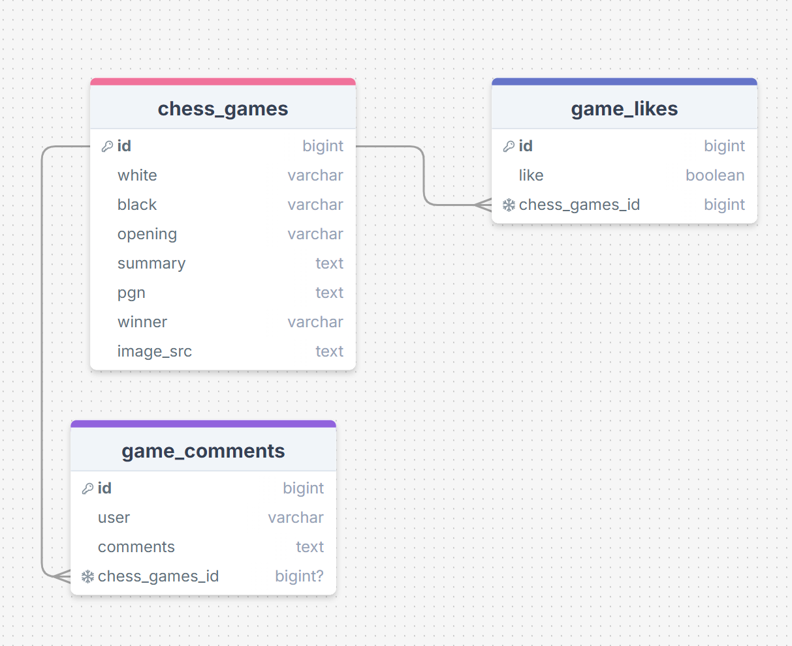
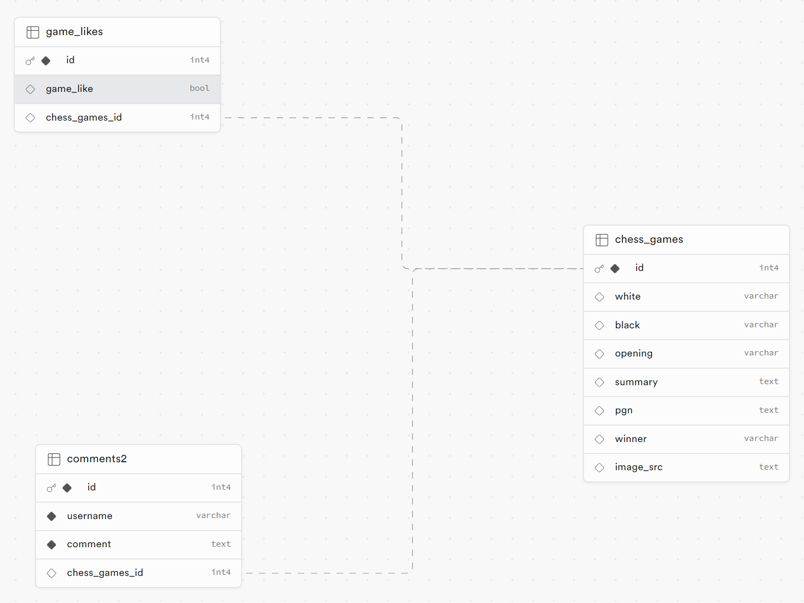

Joe is up to no good
But he is sooooo good at it!

### What does the site do?

This is a full stack app that displays information on chess games from a database. The user also has the ability to add, update, add comments, delete comments. It was designed on Next js

### Requirements

- 🎯 Display all posts on the page, with an option to sort them in ascending or descending order. - done
- 🎯 Create a SQL schema for a posts table and a comments table, with the comments being connected to the posts table with a foreign key. - done
  - Please submit your database schema, as is mentioned in the submission instructions.
- 🎯 Create a delete button on posts that allows users to delete the post from the database. - done with comments
- 🎯 Create a form which saves comments to a dedicated comments table, with the comments being connected to the posts table with a foreign key. - done
- 🎯 Allow users to comment on individual posts in their dynamic routes. Comments should be associated with posts, and have a dynamic route (e.g. `/posts/:postid`). - done
- 🎯 Add a `redirect` when a user creates a post to redirect them to the posts page. - done

### Stretch Requirements

- 🐿️ As a user, I want to categorise my posts during creation so that I can organise my posts and browse other posts by category. - done with chess openings
- 🐿️ As a user, I want to edit my posts on a dedicated route so that I can easily modify my posts. - done
- 🐿️ As a user, I want to edit my comments on a dedicated route so that I can revise my feedback.

### Database Schema

I have three tables with two one to many relationships with likes and comments

### What went well

I completed all of the requirements and most of the stretch goals. I could have added update functionality to the comments as well, but lacked time. I think the site works well and i'm happy i managed to get the update form working with pre filled in default values to improve the user experience.
I also found a react project that someone had done which i was able to use as a pgn viewer to allow users to play through each game on a chessboard. It required minimal code on my part but is a cool feature. It even allows the user to explore other possible branches of the game when playing it through. As a future project I may attempt creating my own.

### What I found difficult

I still find styling difficult but am getting better.
I found adding interactivity ie buttons in server components difficult but managed to pass the right variables and functions through as props to a client component to get it to work where i needed to.
In the view chess games page with the sorting functionality, these are done via Link tags but i would also like to be able to do them with buttons, or maybe a search box too.

### Sources I used

https://medium.com/@anuragangara/building-a-chess-analysis-board-in-react-b59952727d4b
https://github.com/ps2-controller/react-chess-analysis-board
I used these for my pgn viewer. Its an excellent piece of code and very easy to use, i'd love to understand it more and maybe one day build my own if i gain the skills necessary

https://www.youtube.com/watch?v=obib4ka06y0
I used this for my nav bar. It looked cool so i wanted to include it. I kind of understand his code but he does things like passing children and wrapping components around other components that ive not seen before.
